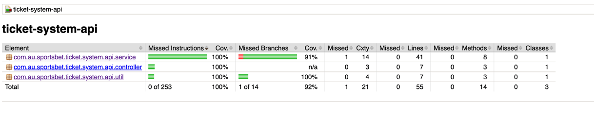

# Movie Ticket System
Spring Boot microservice for Movie Ticket booking. It calculates the total cost of booking price based on individual age.

## Installation
This project use Maven for build and dependency management.

### Maven Setup
1) Download and setup Maven
2) Clean and build the project by running following command
```bash
mvn clean install
```

## Start the Server

```bash
#using maven run
mvn spring-boot:run
```

## Requirements
There are four types of movie tickets
1) Adult: For customers 18 years and older but less than 65 years old. **Costs $25.**
2) Senior: For customers 65 years and older. **30% cheaper than Adult tickets**
3) Teen: For customers 11 years and older but less than 18 years old. **Costs $12**
4) Children: For customers less than 11 years of age. **Costs $5**.

### Discount logic
If there are 3 or more Children's tickets in a transaction, there's a **25% discount** applied to the cost of Children's tickets

Transaction API will respond with the following information.

1) The ID of the transaction
2) Each individual type of movie ticket present in that transaction, ordered alphabetically, and it's quantity and total cost
3) The total cost of all movie tickets for that transaction.

## Spring Boot Actuator

### Service Health
Spring Boot Actuator is running on 8080 port and following URL can be used to check the health
http://localhost:8080/actuator/health

### Service GIT info
Git info can be fetched using below URL
http://localhost:8080/actuator/info

### Sample Request:
```dtd
{
  "transactionId": 2,
  "customers": [
    {
      "name": "Billy Kidd",
      "age": 36
    },
    {
      "name": "Zoe Daniels",
      "age": 3
    },
    {
      "name": "George White",
      "age": 8
    },
    {
      "name": "Tommy Anderson",
      "age": 9
    },
    {
      "name": "JoeSmith",
      "age": 17
    }
  ]
}
```

### Sample Response

```dtd

{
  "transactionId": 2,
  "tickets": [
    {
      "ticketType": "Adult",
      "quantity": 1,
      "totalCost": "25.00"
    },
    {
      "ticketType": "Children",
      "quantity": 3,
      "totalCost": "11.25"
    },
    {
      "ticketType": "Teen",
      "quantity": 1,
      "totalCost": "12.00"
    }
  ],
  "totalCost": "48.25"
}


```

## Test Coverage

**Total Test coverage = 100%.**

Note: DTO, Model and exception packages are excluded from coverage in POM.


